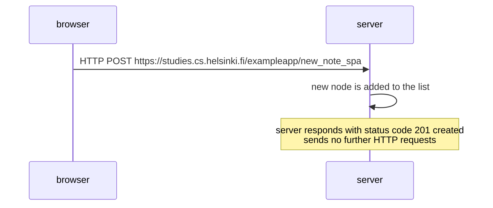

```mermaid
  sequenceDiagram
    participant browser
    participant server

    browser->>server: HTTP POST https://studies.cs.helsinki.fi/exampleapp/new_note_spa
    server->>server: new node is added to the list
    
    Note over server:  server responds with status code 201 created <br> sends no further HTTP requests

```